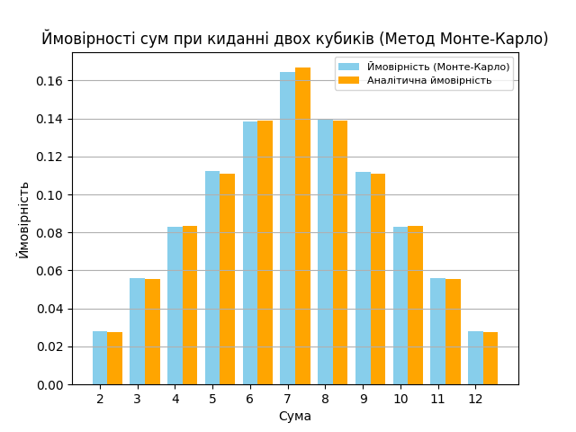

## Висновки до завдання 7

У даному дослідженні було проведено симуляцію кидків двох кубиків за допомогою методу Монте-Карло з метою визначення ймовірностей можливих сум чисел, які випали на кубиках. Для цього було виконано **100,000** кидків кубиків, і результати були порівняні з аналітичними ймовірностями.

### Таблиця результатів

| Сума | Ймовірність (Монте-Карло) | Аналітична ймовірність |
| ---- | ------------------------- | ---------------------- |
| 2    | 0.02796                   | 0.027778               |
| 3    | 0.05587                   | 0.055556               |
| 4    | 0.08300                   | 0.083333               |
| 5    | 0.11222                   | 0.111111               |
| 6    | 0.13837                   | 0.138889               |
| 7    | 0.16456                   | 0.166667               |
| 8    | 0.13920                   | 0.138889               |
| 9    | 0.11178                   | 0.111111               |
| 10   | 0.08303                   | 0.083333               |
| 11   | 0.05586                   | 0.055556               |
| 12   | 0.02815                   | 0.027778               |

### Порівняння результатів

З отриманих даних видно, що ймовірності, отримані за допомогою методу Монте-Карло, досить близькі до аналітичних розрахунків. Наприклад, ймовірність отримання суми 7 складає **0.16456** за методом Монте-Карло, тоді як аналітичне значення дорівнює **0.166667**. Інші значення також демонструють подібні результати, що підтверджує правильність реалізації симуляції.

### Графік ймовірностей

В цілому, результати підтверджують, що метод Монте-Карло є ефективним способом оцінки ймовірностей у даній задачі, і отримані значення відповідають очікуванням.
